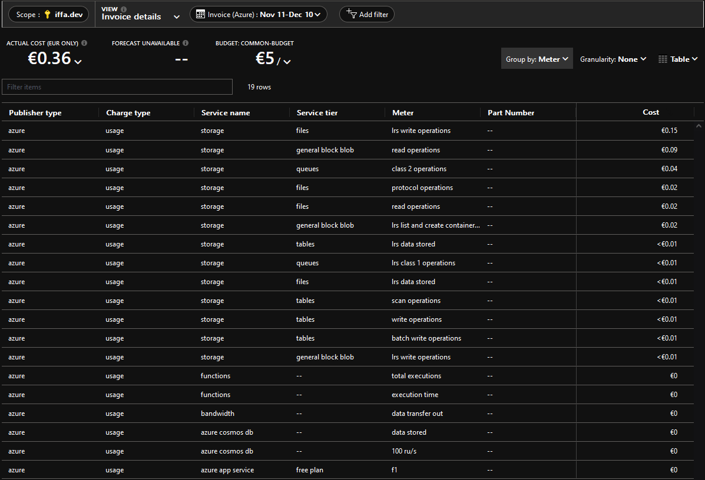

# Xenprowler (backend)

Backend project for Xenprowler, a web app for Xenforo-based forum post alerts.

See also the [frontend project](https://github.com/iffa/xenprowler-ui).

## Background, architecture & the cloud

This project was mainly a learning experience for me, getting to better understand Azure Functions & Durable Functions "in production". The architecture demonstrated in this project is very much overkill for the needs of this project - in reality Durable Functions are not necessary for a project of this size.

Although the project is over-engineered, it is not at all expensive to run. Costs for a few months of uptime in mostly serverless/free tiers is roughly 0.4€/mo. Initial costs were a lot higher until certain optimizations were made, mainly limiting `maxQueuePollingInterval` and `partitionCount` to more sane values in `host.json`. 100% of the costs come from the storage account that running Azure Functions requires, everything else will happily run in free tiers for the rest of eternity, barring any crazy traffic.

| NAME                 | TYPE                    | LOCATION    |
| -------------------- | ----------------------- | ----------- |
| ASP-xenprowler       | App Service plan        | West Europe |
| xenprowler-api       | API Management service  | West Europe |
| xenprowler-functions | Function App            | West Europe |
| xenprowler-ui        | Static Web App          | West Europe |
| xenprowlerstorage    | Storage account         | West Europe |
| xenprowler-db        | Azure Cosmos DB account | West Europe |

## Built with

- [Azure Functions](https://azure.microsoft.com/en-us/services/functions/) and [Durable Functions](https://docs.microsoft.com/en-us/azure/azure-functions/durable/durable-functions-overview?tabs=javascript)
- [TypeScript](https://www.typescriptlang.org/)

## Development and local testing

Note that the following instructions have been written with Windows 10/11 in mind. You may need to adapt if attempting to run this locally on a Unix-based machine.

### Prerequisites

- [Azure Cosmos DB Emulator](https://docs.microsoft.com/en-us/azure/cosmos-db/local-emulator?tabs=ssl-netstd21)
- [Azure Storage Emulator](https://docs.microsoft.com/en-us/azure/storage/common/storage-use-emulator)

### local.settings.json

Create a `local.settings.json` file based on the example provided, and update with appropriate values.

### Running locally

Use `npm run start` to run the Azure Functions runtime in development mode. You may first need to install the Azure Functions runtime, but at least VS Code will prompt you to do so.

## Functions

Due to limitations with how the Azure Functions runtime works, we can't neatly organize functions in subfolders. Since this project has quite a few functions with odd naming, here is a short description of each, to help you get up to speed quicker.

### Auth\*

Functions relating to user authentication are prefixed with `Auth` (duh).

#### AuthGetSession

Simple HTTP endpoint for getting / removing current session details. Xenprowler uses basic JWT auth that is stored in a session cookie.

- GET: get currently active user session from request cookies
- DELETE: remove currently active user session (clear cookie)

#### AuthRequestToken

Endpoint for requesting an authentication token / email magic link. Xenprowler is meant to be simple and to avoid storing passwords in any shape or form, email magic links are the only way to login. Calling this endpoint with the appropriate details will send the client an email with the generated magic login link.

- POST: request auth token (magic link) email

#### AuthVerifyToken

This endpoint is called when the client needs to verify the magic link they received in their email inbox. This endpoint verifies that the magic link is authentic, and contains the proper verification token. Once this is complete, a session authentication token (JWT) is generated and sent to the client as a session cookie. The user is now logged in.

- GET: verify auth token (magic link from email) and provide session cookie for user

### Search\*

Functions prefixed with `Search` contain endpoints for CRUD operations relating to the client's active search queries, and previous search results. User must be authenticated.

#### SearchQueries

- GET: get current search queries for user
- PATCH: update search queries for user

#### SearchResults

- GET: get search results history

### Scout\*

Functions prefixed with `Scout` are all related to the automated process of searching new listings for search query matches from the users' search queries, and sending alerts appropriately via email. Almost all `Scout`-functions are run as Durable Functions -orchestrations, although as alluded to before, this is very much overkill.

To explain shortly, every 15 minutes the orchestration is triggered, which gets all active search queries and orchestrates "activity functions" that are responsible for performing the task of getting active listings and comparing them to the search queries.

If there are any search query matches, a classic CosmosDB trigger is used to send alert emails to users.

#### ScoutOrchestrationTrigger

The starting point of the orchestration, triggered every 15 minutes, with the sole purpose of starting the `ScoutOrchestrator`.

- Timer trigger: starts orchestration

#### ScoutOrchestrator

The orchestrator function, gluing all activity functions together to form a comprehensive orchestration. Calls the following activity functions (some multiple times), in chronological order:

1. `ScoutGetSearchQueriesTask`, exits if no search queries are found
1. `ScoutGetMarketListings`
1. `ScoutFuzzySearchTask`, exits if no search results are found
1. `ScoutSaveResultTask`

#### ScoutGetSearchQueriesTask

Activity that returns active search queries for users.

#### ScoutGetMarketListings

Activity that returns latest market listings, i.e. parses the site for the required information and returns the result. In order to utilize this project as a base for something else, this activity is one of which you should change the implementation of. The current logic is highly specific and written for one site only.

The HTML parser logic is written using [cheerio](https://cheerio.js.org/).

#### ScoutFuzzySearchTask

Activity that performs a fuzzy search through the market listings for any search query matches. This task will work for other content types, given some reconfiguration. The fuzzy search is performed using [Fuse.js](https://fusejs.io/), so it will be kind of fuzzy while not requiring a crazy amount of setup. Depending on your content and search queries, you should tweak the threshold and score filters accordingly. For alert purposes, anything with a score of over 0.3 should be discarded, although a value closer to 0.2 will eliminate further "false positives".

#### ScoutSaveResultTask

Activity that saves search results to the database. Filters duplicates.

#### ScoutSendResultAlertTask

Triggered when new results are saved to CosmosDB. Sends email alerts to the users. In order for email alerting to work, you must have a SendGrid API key and otherwise valid email configuration, in SendGrid and in the project's configuration.

While this is not triggered strictly as part of the `ScoutOrchestrator`, it makes sense to have this prefix as it is only triggered as a direct result of said orchestration.
